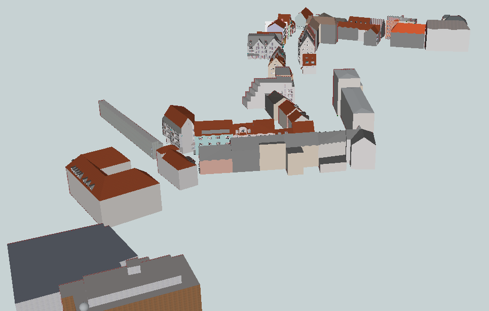

# :open_book: Open Data

This repo contains open datasets of the [research project SAVe](https://save-in.digital), [contributing to the](https://ec.europa.eu/digital-single-market/en/policies/building-european-data-economy):

* creation of safer and cleaner transport systems
* generation of new products and services
* reduction the costs of public services
* improvement of sustainability and energy efficiency

## :house: LoD3 Road Space Models in CityGML

This [CityGML](https://www.ogc.org/standards/citygml) dataset contains road space models (over 50 building models) in the area of [Ingolstadt](https://en.wikipedia.org/wiki/Ingolstadt).
To ensure the highest accuracy geometrically as well as semantically, the dataset was manually modeled based on the mobile laser scannings provided by the company [3D Mapping Solutions GmbH](https://www.3d-mapping.de/en/) (relative accuracy in the range of 1-3cm).
In order to enable the modification of the datasets, SketchUp project files are also provided along with creation guidelines.

- Download: 
	- :house: [CityGML Dataset](https://archive.org/download/lod3-road-space-models-ingolstadt-citygml/LoD3RoadSpaceModels_Ingolstadt_CityGML.zip) 
	- :wrench: [SketchUp Projects](https://archive.org/download/lod3-road-space-models-ingolstadt-citygml/LoD3RoadSpaceModels_Ingolstadt_SketchUp.zip) 
	- :floppy_disk: [archive.org](https://archive.org/details/lod3-road-space-models-ingolstadt-citygml)
- Overview: 
	- :earth_americas: [Web-Map-Client](https://www.3dcitydb.net/3dcitydb-web-map/1.6.1/3dwebclient/?title=Ingolstadt_CityGML_LoD3_Demo&shadows=false&terrainShadows=0&latitude=48.763071515133625&longitude=11.423003822631317&height=229.99322145532363&heading=169.30240914057862&pitch=-44.62859662691198&roll=0.0496187584706029&layer_0=url%3Dhttps%253A%252F%252Fwww.3dcitydb.net%252F3dcitydb%252Ffileadmin%252Fpublic%252F3dwebclientprojects%252Fingolstadt%252Fingolstadt_lod3%252Fkml_ingolstadt_trafficareas%252Fkml_ingolstadt_trafficareas_collada_MasterJSON.json%26name%3DIngolstadt_CityGML_TrafficArea%26layerDataType%3DCOLLADA%252FKML%252FglTF%26layerProxy%3Dfalse%26layerClampToGround%3Dfalse%26gltfVersion%3D2.0%26active%3Dtrue%26spreadsheetUrl%3D%26thematicDataSource%3DGoogleSheets%26tableType%3DHorizontal%26cityobjectsJsonUrl%3D%26minLodPixels%3D0%26maxLodPixels%3D1.7976931348623157e%252B308%26maxSizeOfCachedTiles%3D200%26maxCountOfVisibleTiles%3D200&layer_1=url%3Dhttps%253A%252F%252Fwww.3dcitydb.net%252F3dcitydb%252Ffileadmin%252Fpublic%252F3dwebclientprojects%252Fingolstadt%252Fingolstadt_lod3%252Fkml_ingolstadt_auxiliarytrafficareas%252Fkml_ingolstadt_auxiliarytrafficareas_collada_MasterJSON.json%26name%3DIngolstadt_CityGML_AuxiliaryTrafficArea%26layerDataType%3DCOLLADA%252FKML%252FglTF%26layerProxy%3Dfalse%26layerClampToGround%3Dfalse%26gltfVersion%3D2.0%26active%3Dtrue%26spreadsheetUrl%3D%26thematicDataSource%3DGoogleSheets%26tableType%3DHorizontal%26cityobjectsJsonUrl%3D%26minLodPixels%3D0%26maxLodPixels%3D1.7976931348623157e%252B308%26maxSizeOfCachedTiles%3D200%26maxCountOfVisibleTiles%3D200&layer_2=url%3Dhttps%253A%252F%252Fwww.3dcitydb.net%252F3dcitydb%252Ffileadmin%252Fpublic%252F3dwebclientprojects%252Fingolstadt%252Fingolstadt_lod3%252Fkml_ingolstadt_building_lod3%252Fkml_ingolstadt_building_lod3_collada_MasterJSON.json%26name%3DIngolstadt_CityGML_Building_LoD3%26layerDataType%3DCOLLADA%252FKML%252FglTF%26layerProxy%3Dfalse%26layerClampToGround%3Dfalse%26gltfVersion%3D2.0%26active%3Dtrue%26spreadsheetUrl%3D%26thematicDataSource%3DGoogleSheets%26tableType%3DHorizontal%26cityobjectsJsonUrl%3D%26minLodPixels%3D0%26maxLodPixels%3D1.7976931348623157e%252B308%26maxSizeOfCachedTiles%3D200%26maxCountOfVisibleTiles%3D200&layer_3=url%3Dhttps%253A%252F%252Fwww.3dcitydb.net%252F3dcitydb%252Ffileadmin%252Fpublic%252F3dwebclientprojects%252Fingolstadt%252Fingolstadt_lod3%252Fkml_ingolstadt_sections%252Fkml_ingolstadt_sections_collada_MasterJSON.json%26name%3DIngolstadt_CityGML_Section%26layerDataType%3DCOLLADA%252FKML%252FglTF%26layerProxy%3Dfalse%26layerClampToGround%3Dfalse%26gltfVersion%3D2.0%26active%3Dfalse%26spreadsheetUrl%3D%26thematicDataSource%3DGoogleSheets%26tableType%3DHorizontal%26cityobjectsJsonUrl%3D%26minLodPixels%3D0%26maxLodPixels%3D1.7976931348623157e%252B308%26maxSizeOfCachedTiles%3D200%26maxCountOfVisibleTiles%3D200&layer_4=url%3Dhttps%253A%252F%252Fwww.3dcitydb.net%252F3dcitydb%252Ffileadmin%252Fpublic%252F3dwebclientprojects%252Fingolstadt%252Fingolstadt_lod3%252Fkml_ingolstadt_intersection%252Fkml_ingolstadt_intersection_collada_MasterJSON.json%26name%3DIngolstadt_CityGML_Intersection%26layerDataType%3DCOLLADA%252FKML%252FglTF%26layerProxy%3Dfalse%26layerClampToGround%3Dfalse%26gltfVersion%3D2.0%26active%3Dfalse%26spreadsheetUrl%3D%26thematicDataSource%3DGoogleSheets%26tableType%3DHorizontal%26cityobjectsJsonUrl%3D%26minLodPixels%3D0%26maxLodPixels%3D1.7976931348623157e%252B308%26maxSizeOfCachedTiles%3D200%26maxCountOfVisibleTiles%3D200&splashWindow=url%3Dsplash%252FSplashWindow.html%26showOnStart%3Dfalse) (selection of LoD3 models combined with [converted](https://rtron.io) OpenDRIVE dataset)
- License: 
	- :page_facing_up: [CC BY-SA 4.0](https://creativecommons.org/licenses/by-sa/4.0/)
- Creation guideline: 
	- :eyeglasses: [Creating LoD3 Models Based on Point Clouds](https://creating-citygml-datasets.readthedocs.io/en/latest/creation-guidelines/lod3-models-based-on-point-clouds.html)

    
    
    

## :triangular_flag_on_post: What is modeled in LoD3?

There are several approaches to model Building in CityGML 2.0 (e.g. see [Bilijecki et al.](http://pure.tudelft.nl/ws/portalfiles/portal/4377508/Biljecki2016to.pdf)). In our case, due to the acquistion geometry of mobile laser scanning point clouds, the Building object consists of very detailed representation of facades elements but on the other hand it might lack roof elements and entities located in the Building's backyard. Thus, we encourage to see the list below for detailed description of the Building in our Ingolstadt LoD3 dataset:

- :house: Building consists of:
	- Ground Surfaces
	- Roof Surfaces
	- Wall Surfaces
	- Outer Ceiling Surfaces
	- Outer Floor Surfaces
	- Closure Surfaces	
	- Windows modeled in detail 
	- Doors modeled in detail 
	- Building Installations 
		- Balconies 
		- Passages 
		- Arcades 
		- Loggias
		- Stairs and Porches
		- (Some) Dormers
	- Textures (approximated based on visual inspection)

- :house: Building does NOT consists of:
	- Overhanging Building Elements
	- Roof structure details
	- Objects located in the Building's backyard (not facing the street)
	- Building Installations 
		- Chimneys
		- Rain Gutters
		- (Some) Dormers
	- Real (e.g. ortophoto) textures
	
The terminology according to [SIG3D](https://en.wiki.quality.sig3d.org/index.php?title=Modeling_Guide_for_3D_Objects_-_Part_2:_Modeling_of_Buildings_(LoD1,_LoD2,_LoD3)).

This dataset is under active development.
To expand and improve the dataset, [feedback and contributions](https://github.com/savein/open-data/issues) are always appreciated.

Very special acknowledgements are due to [Sophie](https://github.com/Sophie876) and [Olaf](https://github.com/OloOcki), who worked diligently on the development of the methodology and the realization of the modeling.
