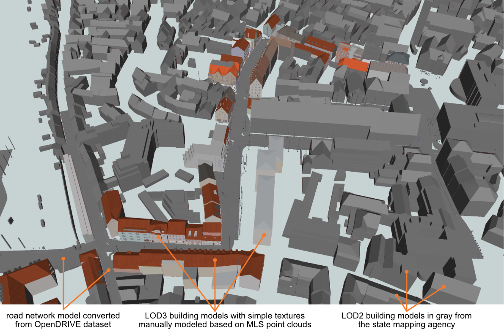
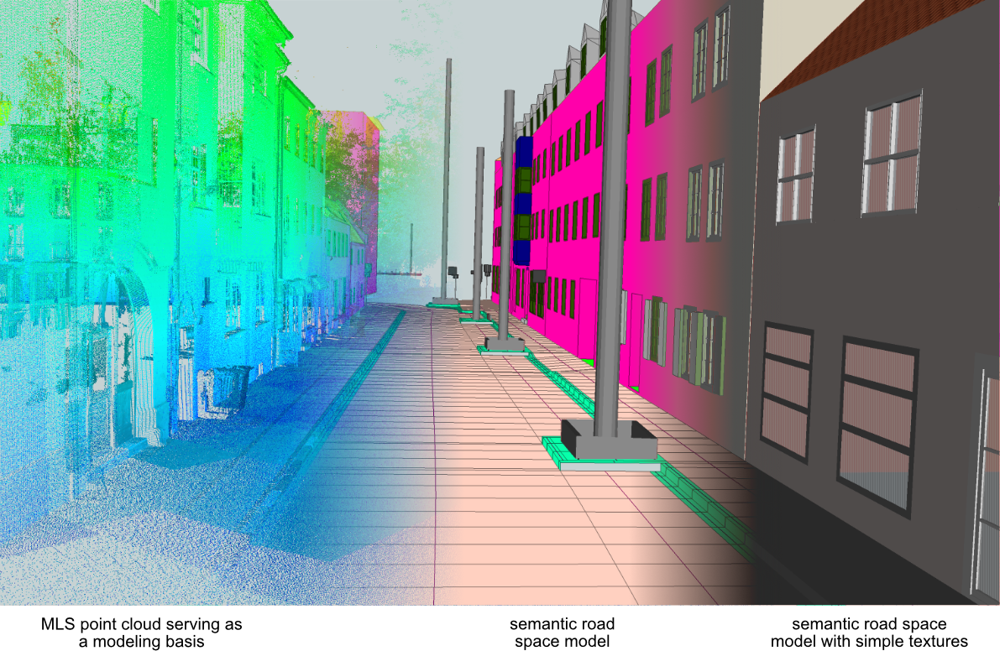

# :cityscape: LOD3 Road Space Models

Semantic models of the road spaces in the inner city of [Ingolstadt](https://en.wikipedia.org/wiki/Ingolstadt) in Germany at the level of detail 3:

- the comprehensive model of the road spaces is provided as [OGC CityGML](https://www.ogc.org/standard/citygml/) 2.0 and 3.0 datasets
- the road network is provided as an [ASAM OpenDRIVE](https://www.asam.net/standards/detail/opendrive/) demo dataset from the company [3D Mapping Solutions](https://www.3d-mapping.de/en/)



## :rocket: Getting Started

Download the semantic models by cloning the repo:

```bash
git clone --depth 1 git@github.com:savenow/lod3-road-space-models.git
```

## :inbox_tray: Datasets

- [models/road-network/opendrive](models/road-network/opendrive)
  - Content: Road network with roadside objects
  - Source: Demo dataset by the company [3D Mapping Solutions](https://www.3d-mapping.de/en/customer-area/demo-data/)
  - Conceptual data model: ASAM OpenDRIVE 1.4
  - Encoding: XML
  - License: `CC BY-NC-SA 4.0`
- [models/road-network/citygml](models/road-network/citygml)
  - Content: Road network with roadside objects
  - Source: Converted from OpenDRIVE demo dataset to CityGML 2.0 and 3.0 using the tool [r:trån](https://rtron.io)
  - Conceptual data model: OGC CityGML 2.0 and 3.0
  - Encoding: GML
  - License: `CC BY-NC-SA 4.0`
- [models/building/lod3](models/building/lod3)
  - Content: Over 50 LOD3 building models
  - Source: Manually modeled based on the MLS point clouds by 3D Mapping Solutions
  - Conceptual data model: OGC CityGML 2.0 and 3.0
  - Encoding: GML
  - License: `CC BY-SA 4.0`
- [models/building/lod2](models/building/lod2)
  - Content: 4 tiles of LOD2 building models 
  - Source: [Open data portal](https://geodaten.bayern.de/opengeodata/OpenDataDetail.html?pn=lod2) of the Bavarian State Mapping Agency
  - Conceptual data model: OGC CityGML 2.0 and 3.0
  - Encoding: GML
  - License: `CC BY 4.0`

## :mag: Modeling Details

The LOD3 building models were manually modeled using the tool SketchUp with the [CityEditor](https://www.3dis.de/cityeditor/) extension.
For this, mobile laser scanning (MLS) point clouds by the company [3D Mapping Solutions GmbH](https://www.3d-mapping.de/en/) with a relative accuracy of 1-3 cm served as the basis for modeling.
The SketchUp project files are also provided along with a [creation guideline](https://creating-citygml-datasets.readthedocs.io/en/latest/creation-guidelines/lod3-models-based-on-point-clouds.html) that documents the entire modeling process.

Further information:

- Modeling aspects: [What is modeled?](documentation/modeling_aspects.md)
- Overview: [Web-Map-Client](https://www.3dcitydb.net/3dcitydb-web-map/1.6.1/3dwebclient/?title=Ingolstadt_CityGML_LoD3_Demo&shadows=false&terrainShadows=0&latitude=48.76421616414265&longitude=11.423261087465157&height=189.46220553536946&heading=170.97575939059712&pitch=-39.02715451772515&roll=0.03843163755915946&layer_0=url%3Dhttps%253A%252F%252Fwww.3dcitydb.net%252F3dcitydb%252Ffileadmin%252Fpublic%252F3dwebclientprojects%252Fingolstadt%252Fingolstadt_lod3%252Fkml_ingolstadt_trafficareas%252Fkml_ingolstadt_trafficareas_collada_MasterJSON.json%26name%3DIngolstadt_CityGML_TrafficArea%26active%3Dtrue%26spreadsheetUrl%3D%26cityobjectsJsonUrl%3D%26minLodPixels%3D0%26maxLodPixels%3D1.7976931348623157e%252B308%26maxSizeOfCachedTiles%3D200%26maxCountOfVisibleTiles%3D200&layer_1=url%3Dhttps%253A%252F%252Fwww.3dcitydb.net%252F3dcitydb%252Ffileadmin%252Fpublic%252F3dwebclientprojects%252Fingolstadt%252Fingolstadt_lod3%252Fkml_ingolstadt_auxiliarytrafficareas%252Fkml_ingolstadt_auxiliarytrafficareas_collada_MasterJSON.json%26name%3DIngolstadt_CityGML_AuxiliaryTrafficArea%26active%3Dtrue%26spreadsheetUrl%3D%26cityobjectsJsonUrl%3D%26minLodPixels%3D0%26maxLodPixels%3D1.7976931348623157e%252B308%26maxSizeOfCachedTiles%3D200%26maxCountOfVisibleTiles%3D200&layer_2=url%3Dhttps%253A%252F%252Fwww.3dcitydb.net%252F3dcitydb%252Ffileadmin%252Fpublic%252F3dwebclientprojects%252Fingolstadt_2%255Ckml_building_lod3_ingolstadt_neu%252Fkml_building_lod3_ingolstadt_collada_MasterJSON.json%26name%3DIngolstadt_CityGML_Building_LoD3%26active%3Dtrue%26spreadsheetUrl%3D%26cityobjectsJsonUrl%3D%26minLodPixels%3D0%26maxLodPixels%3D1.7976931348623157e%252B308%26maxSizeOfCachedTiles%3D200%26maxCountOfVisibleTiles%3D200&layer_3=url%3Dhttps%253A%252F%252Fwww.3dcitydb.net%252F3dcitydb%252Ffileadmin%252Fpublic%252F3dwebclientprojects%252Fingolstadt%252Fingolstadt_lod3%252Fkml_ingolstadt_sections%252Fkml_ingolstadt_sections_collada_MasterJSON.json%26name%3DIngolstadt_CityGML_Section%26active%3Dfalse%26spreadsheetUrl%3D%26cityobjectsJsonUrl%3D%26minLodPixels%3D0%26maxLodPixels%3D1.7976931348623157e%252B308%26maxSizeOfCachedTiles%3D200%26maxCountOfVisibleTiles%3D200&layer_4=url%3Dhttps%253A%252F%252Fwww.3dcitydb.net%252F3dcitydb%252Ffileadmin%252Fpublic%252F3dwebclientprojects%252Fingolstadt%252Fingolstadt_lod3%252Fkml_ingolstadt_intersection%252Fkml_ingolstadt_intersection_collada_MasterJSON.json%26name%3DIngolstadt_CityGML_Intersection%26active%3Dfalse%26spreadsheetUrl%3D%26cityobjectsJsonUrl%3D%26minLodPixels%3D0%26maxLodPixels%3D1.7976931348623157e%252B308%26maxSizeOfCachedTiles%3D200%26maxCountOfVisibleTiles%3D200) with the LOD3 building and road network models (kudos to [Christof Beil](https://github.com/ChBeil))



## :incoming_envelope: Feedback & Contributions

To expand and improve the dataset, [feedback and contributions](https://github.com/savenow/lod3-road-space-models/issues) are always appreciated.
You can also contact me directly via mail [benedikt.schwab@tum.de](mailto:benedikt.schwab@tum.de?subject=[GitHub]%20LOD3%20Road%20Space%20Models).

## :handshake: Thanks

Very special acknowledgments are due to [Sophie Haas Goschenhofer](https://github.com/Sophie876) and [Olaf Wysocki](https://github.com/OloOcki), who worked diligently on the development of the methodology and the realization of the modeling.
